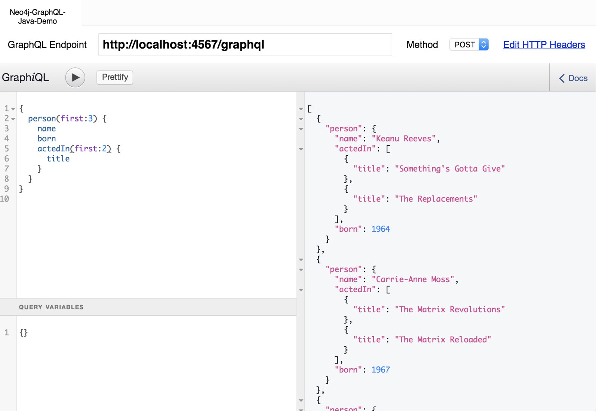

= JVM Library to translate GraphQL queries and mutations to Neo4j's Cypher
:version: 1.3.0
:toc:
:toclevels: 1
:toc-title: Quick Links

This is a https://graphql.org[GraphQL] to https://neo4j.com/developer/cypher[Cypher] transpiler written in Kotlin.

License: Apache 2.

== How does it work

This library

1. parses a GraphQL schema and
2. uses the information of the annotated schema to translate _GraphQL_ queries and parameters into _Cypher_ queries and parameters.

Those Cypher queries can then executed, e.g via the Neo4j-Java-Driver (or other JVM drivers) against the graph database and the results can be returned directly to the caller.

The request, result and error handling is not part of this library, but we provide demo programs on how to use it in different languages.

NOTE: All the <<features,supported features>> are listed and explained below, more detailed docs will be added in time.

== Examples

For complex examples take a look at our link:examples/readme.adoc[example projects]

== API compatibility to @neo4j/graphql

Since the javascript pendant of this library (neo4j-graphql-js) has majored into a neo4j product, we want to migrate our augmented schema, to match as much as possible to the one of the https://github.com/neo4j/graphql-tracker-temp[`@neo4j/graphql`].
Therefore, we created a https://github.com/neo4j-graphql/neo4j-graphql-java/issues?q=label%3AAPI-Alignment[list of issues to track progress].

We will try to make the migration as smooth as possible. For this purpose we will support the old, and the new way of schema augmentation until the next major release.
To already test the new features, you can enable them via link:core/src/main/kotlin/org/neo4j/graphql/SchemaConfig.kt[some setting in the `SchemaConfig`]

== FAQ

=== How does this relate to the other neo4j graphql libraries?

https://grandstack.io[The GRANDstack^] is a full-stack package that integrates React frontends via GraphQL through `neo4j-graphql-js` with Neo4j.

Similar to https://grandstack.io/docs/neo4j-graphql-js-quickstart[`neo4j-graphql-js`] this library focuses on query translation, just for the *JVM* instead of Node.js.
It does not provide a server (except as examples) or other facilities but is meant to be used as a dependency included for a single purpose.

We plan to replace the code in the current Neo4j server plugin `neo4j-graphql` with a single call to this library.
The server plugin could still exist as an example that shows how to handle request-response and error-handling, and perhaps some minimal schema management but be slimmed down to a tiny piece of code.

=== How does this related to graphql-java

This library uses `graphql-java` under the hood for parsing of schema and queries, and managing the GraphQL state and context.
But *not for nested field resolvers or data fetching*.

If you wanted, you could combine `graphql-java` resolvers with this library to have a part of your schema handled by Neo4j.

Thanks a lot to the maintainers of `graphql-java` for the awesome library.

NOTE: We also use `neo4j-opencypher-dsl` provided graciously by the spring-data-neo4j-rx project to generate our cypher queries.

== Usage

You can use the library as dependency: `org.neo4j:neo4j-graphql-java:{version}` in any JVM program.

The basic usage should be:

[source,kotlin]
----
val schema =
        """
        type Person {
            name: ID!
            age: Int
        }
        # Optional if you use generated queries
        type Query {
            person : [Person]
            personByName(name:ID) : Person
        }"""

val query = """ { p:personByName(name:"Joe") { age } } """

val schema = SchemaBuilder.buildSchema(idl)
val ctx = QueryContext()
val (cypher, params) = Translator(schema).translate(query, params, ctx)

// generated Cypher
cypher == "MATCH (p:Person) WHERE p.name = $pName RETURN p {.age} as p"
----

You find more usage examples in the:

* link:core/src/test/resources/movie-tests.adoc[Movie TCK]
* link:core/src/test/resources/filter-tests.adoc[Filter TCK]
* link:core/src/test/resources/cypher-directive-tests.adoc[Cypher Directive TCK]
* link:core/src/test/resources/property-tests.adoc[Property TCK]
* link:core/src/test/resources/translator-tests1.adoc[Translator 1 TCK]
* link:core/src/test/resources/translator-tests2.adoc[Translator 2 TCK]
* link:core/src/test/resources/translator-tests3.adoc[Translator 3 TCK]
* link:core/src/test/resources/translator-tests-custom-scalars.adoc[Translator custom scalars TCK]
* link:core/src/test/resources/optimized-query-for-filter.adoc[Alternative Filter TCK]

== Demo

Here is a minimalistic example in Groovy using the Neo4j-Java driver and Spark-Java as webserver.
It is running against a Neo4j instance at `bolt://localhost` (username: `neo4j`, password: `s3cr3t`) containing the `:play movies` graph.

(You can also use a link:core/src/test/kotlin/GraphQLServer.kt[Kotlin based server example].)

In case you wand to bind the neo4j driver directly to the graphql schema you can
link:core/src/test/kotlin/DataFetcherInterceptorDemo.kt[use the DataFetchingInterceptor to
intercept the cypher queries].

[source,groovy,subs=attributes]
----
// Simplistic GraphQL Server using SparkJava
@Grapes([
  @Grab('com.sparkjava:spark-core:2.7.2'),
  @Grab('org.neo4j.driver:neo4j-java-driver:1.7.2'),
  @Grab('com.google.code.gson:gson:2.8.5'),
  @Grab('org.neo4j:neo4j-graphql-java:{version}')
])

import spark.*
import static spark.Spark.*
import com.google.gson.Gson
import org.neo4j.graphql.*
import org.neo4j.driver.v1.*

schema = """
type Person {
  name: ID!
  born: Int
  actedIn: [Movie] @relation(name:"ACTED_IN")
}
type Movie {
  title: ID!
  released: Int
  tagline: String
}
type Query {
    person : [Person]
}
"""

gson = new Gson()
render = (ResponseTransformer)gson.&toJson
def query(value) { gson.fromJson(value,Map.class)["query"] }

graphql = new Translator(SchemaBuilder.buildSchema(schema))
def translate(query) { graphql.translate(query) }

driver = GraphDatabase.driver("bolt://localhost",AuthTokens.basic("neo4j","s3cr3t"))
def run(cypher) { driver.session().withCloseable {
     it.run(cypher.query, Values.value(cypher.params)).list{ it.asMap() }}}

post("/graphql","application/json", { req, res ->  run(translate(query(req.body())).first()) }, render);
----
// include::docs/Server.groovy[]

Run the example with:

----
groovy docs/Server.groovy
----

and use http://localhost:4567/graphql as your GraphQL URL.

It uses a schema of:

[source,graphql]
----
type Person {
  name: ID!
  born: Int
  actedIn: [Movie] @relation(name:"ACTED_IN")
}
type Movie {
  title: ID!
  released: Int
  tagline: String
}
type Query {
    person : [Person]
}
----

And can run queries like:

[source,graphql]
----
{
  person(first:3) {
    name
    born
    actedIn(first:2) {
      title
    }
  }
}
----

You can also test it with `curl`

----
curl -XPOST http://localhost:4567/graphql -d'{"query":"{person {name}}"}'
----

This example doesn't handle introspection queries, but the one in the test directory does.

== Advanced Queries

.Filter, Sorting, Paging support
----
{
  person(filter: {name_starts_with: "L"}, orderBy: "born_asc", first: 5, offset: 2) {
    name
    born
    actedIn(first: 1) {
      title
    }
  }
}
----

----
{
  person(filter: {name_starts_with: "J", born_gte: 1970}, first:2) {
    name
    born
    actedIn(first:1) {
      title
      released
    }
  }
}
----

[[features]]
== Features

=== Current

* parse SDL schema
* resolve query fields via result types
* handle arguments as equality comparisons for top level and nested fields
* handle relationships via @relation directive on schema fields
* @relation directive on types for rich relationships (from, to fields for start & end node)
* handle first, offset arguments
* argument types: string, int, float, array
* request parameter support
* parametrization for cypher query
* aliases
* inline and named fragments
* auto-generate query fields for all objects
* @cypher directive for fields to compute field values, support arguments
* @cypher directive for top level queries and mutations, supports arguments
* @cypher directives can have a  `passThrough:true` argument, that gives sole responsibility for the nested query result for this field to your Cypher query. You will have to provide all data/structure required by client queries.
Otherwise, we assume if you return object-types that you will return the appropriate nodes from your statement.
* auto-generate mutation fields for all objects to create, update, delete
* date(time)
* interfaces
* complex filter parameters, with optional query optimization strategy
* scalars
* spatial
* skip limit params
* sorting (nested)
* ignoring fields

=== Next

* input types
* unions

== Documentation

=== Parse SDL schema

* Currently schemas with object types, enums, fragments and Query types are parsed and handled.
* `@relation` directives on fields and types for rich relationships
* `@cypher` directives on fields and top-level query and mutation fields.
* The configurable augmentation auto-generates queries and mutations (create,update,delete) for all types.
* Supports the built-in scalars for GraphQL.
* For arguments input types in many places and filters from GraphCool/Prisma.

=== Resolve query Fields via Result Types

For _query fields_ that result in object types (even if wrapped in list/non-null), the appropriate object type is determined via the schema and used to translate the query.

e.g.

[source,graphql]
----
type Query {
  person: [Person]
}
# query "person" is resolved to and via "Person"

type Person {
  name : String
}
----

=== Handle Arguments as Equality Comparisons for Top Level and Nested Fields

If you add a simple argument to your top-level query or nested related fields, those will be translated to direct equality comparisons.

[source,graphql]
----
person(name:"Joe", age:42) {
   name
}
----

to an equivalent of

[source,cypher]
----
MATCH (person:Person) WHERE person.name = 'Joe' AND person.age = 42 RETURN person { .name } AS person
----

The literal values are turned into Cypher query parameters.

=== Handle Relationships via @relation Directive on Schema Fields

If you want to represent a relationship from the graph in GraphQL you have to add a `@relation` directive which contains the relationship-type and the direction.
The default direction for a relationship is 'OUT'.  Other values are 'IN' and 'BOTH'.
So you can use different domain names in your GraphQL fields that are independent of your graph model.

[source,graphql]
----
type Person {
  name : String
  actedIn: [Movie] @relation(name:"ACTED_IN", direction:OUT)
}
----

[source,graphql]
----
person(name:"Keanu Reeves") {
  name
  actedIn {
    title
  }
}
----

NOTE: We use Neo4j's _pattern comprehensions_ to represent nested graph patterns in Cypher.
This will be updated to subqueries from 4.1

=== Handle first, offset Arguments

To support pagination `first` is translated to `LIMIT` in Cypher and `offset` into `SKIP`
For nested queries these are converted into slices for arrays.

[source,graphql]
----
person(offset: 5, first:10) {
  name
}
----

[source,cypher]
----
MATCH (person:Person) RETURN person { .name }  AS person SKIP 5 LIMIT 10
----

=== Argument Types: string, int, float, array

The default Neo4j Cypher types are handled both as argument types as well as field types.

NOTE: Spatial is not yet covered.

=== Usage of ID

Each type is expected to have exactly one filed of type `ID` defined.
If the field is named `_id`, it is interpreted as the database internal graph ID.

So there are 3 cases:

.Case 1: Only the _ID_ field exists
[source,graphql]
----
type User {
  email: ID!
  name: String!
}
----

.Case 2: Only the _ID_ field exists interpreted as internal ID
[source,graphql]
----
type User {
  _id: ID!
  email: String!
  name: String!
}
----

.Case 3: An _ID_ field exists but the internal ID is propagated as well
[source,graphql]
----
type User {
  _id: Int!
  email: ID!
  name: String!
}
----

IMPORTANT: For the auto generated queries and mutations the `ID` field is used as _primary key_.

TIP: You should create a unique constraint on the `ID` fields

=== Parameter Support

GraphQL parameters are passed onto Cypher, these are resolved correctly when used within the GraphQL query.

=== Parametrization

For query injection prevention and caching purposes, literal values are translated into parameters.

[source,graphql]
----
person(name:"Joe", age:42, first:10) {
   name
}
----

to

[source,cypher]
----
MATCH (person:Person)
WHERE person.name = $personName AND person.age = $personAge
RETURN person { .name } AS person
LIMIT $first
----

Those parameters are returned as part of the `Cypher` type that's returned from the `translate()` method.

=== Aliases

We support query aliases, they are used as Cypher aliases too, so you get them back as keys in your result records.

For example:

[source,graphql]
----
query {
  jane: person(name:"Jane") { name, age }
  joe: person(name:"Joe") { name, age }
}
----

=== Inline and Named Fragments

This is more of a technical feature, both types of fragments are resolved internally.

=== Sorting (top-level)

We support sorting via an `orderBy` argument, which takes an Enum or String value of `fieldName_asc` or `fieldName_desc`.

[source,graphql]
----
query {
  person(orderBy:[name_asc, age_desc]) {
     name
     age
  }
}
----

[source,cypher]
----
MATCH (person:Person)
RETURN person { .name, .age } AS person

ORDER BY person.name ASC, person.age DESC
----

NOTE: We don't yet support ordering on nested relationship fields.

=== Handle Rich Relationships via @relation Directive on Schema Types

To represent rich relationship types with properties, a `@relation` directive is supported on an object type.

In our example it would be the `Role` type.

[source,graphql]
----
type Role @relation(name:"ACTED_IN", from:"actor", to:"movie") {
   actor: Person
   movie: Movie
   roles: [String]
}
type Person {
  name: String
  born: Int
  roles: [Role]
}
type Movie {
  title: String
  released: Int
  characters: [Role]
}
----

[source,graphql]
----
person(name:"Keanu Reeves") {
   roles {
      roles
      movie {
        title
      }
   }
}
----

[[filters]]
=== Filters

Filters are a powerful way of selecting a subset of data.
Inspired by the https://www.graph.cool/docs/reference/graphql-api/query-api-nia9nushae[graph.cool/Prisma filter approach^], our filters work the same way.

These filters are documented in detail in the https://grandstack.io/docs/graphql-filtering [GRANDstack docs^].

We use nested input types for arbitrary filtering on query types and fields.

[source,graphql]
----
{ Company(filter: { AND: { name_contains: "Ne", country_in ["SE"]}}) { name } }
----

You can also apply nested filter on relations, which use suffixes like `("",not,some, none, single, every)`

[source,graphql]
----
{ Company(filter: {
    employees_none { name_contains: "Jan"},
    employees_some: { gender_in : [female]},
    company_not: null })
    {
      name
    }
}
----

==== Optimized Filters

If you encounter performance problems with the cypher queries generated for the filter,
you can activate an alternative algorithm using:

[source,kotlin]
----
var query
try {
    val ctx = QueryContext(optimizedQuery = setOf(QueryContext.OptimizationStrategy.FILTER_AS_MATCH))
    query = translator.translate(query, params, ctx)
} catch (e: OptimizedQueryException) {
    query = translator.translate(query, params)
}
----

If no query can be generated by the alternative algorithm, an `OptimizedQueryException` is thrown,
so that a fallback to the actual algorithm can used.

link:core/src/test/resources/optimized-query-for-filter.adoc[Examples of the alternative algorithm] can be seen in the tests.

=== Inline and Named Fragments

We support inline and named fragments according to the GraphQL spec.
Most of this is resolved on the parser/query side.

.Named Fragment
[source,graphql]
----
fragment details on Person { name, email, dob }
query {
  person {
    ...details
  }
}
----

.Inline Fragment
[source,graphql]
----
query {
  person {
    ... on Person { name, email, dob }
  }
}
----

=== @cypher Directives

With `@cypher` directives you can add the power of Cypher to your GraphQL API.

It allows you, without code to *compute field values* using complex queries.

You can also write your own, *custom top-level queries and mutations* using Cypher.

Arguments on the field are passed to the Cypher statement as parameters.
Input types are supported, they appear as `Map` type in your Cypher statement.

NOTE: Those Cypher directive queries are only included in the generated Cypher statement if the field or query is included in the GraphQL query.

==== On Fields

.@cypher directive on a field
[source,graphql]
----
type Movie {
  title: String
  released: Int
  similar(limit:Int=10): [Movie] @cypher(statement:
        """
        MATCH (this)-->(:Genre)<--(sim)
        WITH sim, count(*) as c ORDER BY c DESC LIMIT $limit
        RETURN sim
        """)
}
----

Here the `this` variable is bound to the current movie.
You can use it to navigate the graph and collect data.
The `limit` variable is passed to the query as parameter.

==== On Queries

Similarly, you can use the `@cypher` directive with a top-level query.

.@cypher directive on query
[source,graphql]
----
type Query {
   person(name:String) Person @cypher("MATCH (p:Person) WHERE p.name = $name RETURN p")
}
----

You can also return arrays from your query, the statements on query fields should be read-only queries.

==== On Mutations

You can do the same for mutations, just with updating Cypher statements.

.@cypher directive on mutation
[source,graphql]
----
type Mutation {
   createPerson(name:String, age:Int) Person @cypher("CREATE (p:Person) SET p.name = $name, p.age = $age RETURN p")
}
----

You can use more complex statements for creating these entities or even subgraphs.

NOTE: The common CRUD mutations and queries are auto-generated, see below.

=== Auto Generated Queries and Mutations

To reduce the amount of boilerplate code you have to write, we auto-generate generate top-level CRUD queries and mutations for all types.

This is configurable via the API, you can:

* disable auto-generation (for mutations/queries)
* disable per type
* disable mutations per operation (create,delete,update)
* configure capitalization of top level generated fields

For a schema like this:

[source,graphql]
----
type Person {
   id:ID!
   name: String
   age: Int
   movies: [Movie]
}
----

It would auto-generate quite a lot of things:

* a query: `person(id:ID, name:String , age: Int, _id: Int, filter:_PersonFilter, orderBy:_PersonOrdering, first:Int, offset:Int) : [Person]`
* a `_PersonOrdering` enum, for the `orderBy` argument with all fields for `_asc` and `_desc` sort order
* a `_PersonInput` for creating Person objects
* a `_PersonFilter` for the `filter` argument, which is a deeply nested input object (see <<filters>>)
* mutations for:
** createPerson: `createPerson(id:ID!, name:String, age: Int) : Person`
** mergePerson:  `mergePerson(id:ID!,  name:String, age:Int) : Person`
** updatePerson: `updatePerson(id:ID!, name:String, age:Int) : Person`
** deletePerson: `deletePerson(id:ID!) : Person`
** addPersonMovies: `addPersonMovies(id:ID!,movies:[ID!]!) : Person`
** deletePersonMovies: `deletePersonMovies(id:ID!,movies:[ID!]!) : Person`

You can then use those in your GraphQL queries like this:

[source,graphql]
----
query { person(age:42, orderBy:name_asc) {
   id
   name
   age
}
----

or

[source,graphql]
----
mutation {
  createPerson(id: "34920n9qw0", name:"Jane Doe", age:42) {
    id
    name
    age
  }
}
----

You find more examples in the link:core/src/test/resources/augmentation-tests.adoc[Augmentation Tests]
and the link:core/src/test/resources/custom-fields.adoc[Custom queries and mutations Tests]

== Build time schema augmentation

Sometimes you need the possibility to generate the augmented schema at compile time. To achieve this, we provide a maven plugin which can be used as follows:

[source,xml,subs="attributes,verbatim"]
----
<plugin>
    <groupId>org.neo4j</groupId>
    <artifactId>neo4j-graphql-augmented-schema-generator-maven-plugin</artifactId>
    <version>{version}</version>
    <executions>
        <execution>
            <goals>
                <goal>generate-schema</goal>
            </goals>
            <configuration>
                <schemaConfig> <!--1-->
                    <pluralizeFields>true</pluralizeFields>
                    <useWhereFilter>true</useWhereFilter>
                    <queryOptionStyle>INPUT_TYPE</queryOptionStyle>
                    <mutation>
                        <enabled>false</enabled>
                    </mutation>
                </schemaConfig>
                <outputDirectory>${project.build.directory}/augmented-schema</outputDirectory>
                <fileset> <!--2-->
                    <directory>${project.basedir}/src/main/resources</directory>
                    <include>*.graphql</include>
                </fileset>
            </configuration>
        </execution>
    </executions>
</plugin>
----
<1> Use the same configuration as for your SchemaBuilder
<2> Define the source schema for which you want to have an augmented schema generated

Take a look at the link:./examples/dgs-spring-boot/readme.adoc[spring boot dsg] example for a use case of this plugin, where it is used in combination with a code generator to have a type save graphql API
